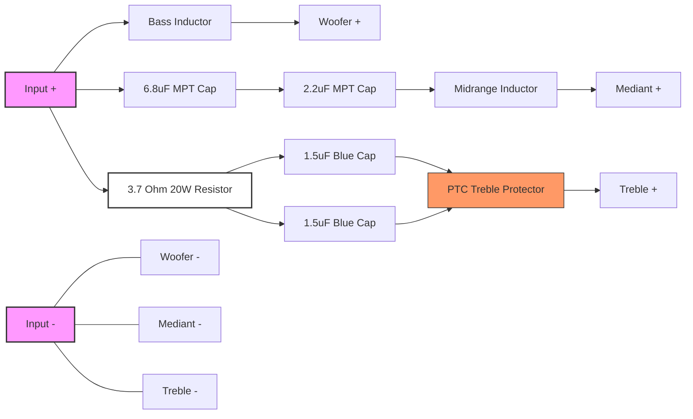

```mermaid

graph LR
    %% Input Terminals
    IN_P[Input +]
    IN_N[Input -]

    %% Bass Section (1st Order Low Pass)
    IN_P --> L_BASS[Bass Inductor]
    L_BASS --> W_P[Woofer +]

    %% Midrange Section (Band-Pass)
    IN_P --> C_MID_MAIN[6.8uF MPT Cap]
    C_MID_MAIN --> C_MID_SUB[2.2uF MPT Cap]
    C_MID_SUB --> L_MID[Midrange Inductor]
    L_MID --> M_P[Mediant +]

    %% Treble Section (High-Pass with Protection)
    IN_P --> R_ATT[3.7 Ohm 20W Resistor]
    R_ATT --> C_TREB_1[1.5uF Blue Cap]
    R_ATT --> C_TREB_2[1.5uF Blue Cap]
    C_TREB_1 --> PTC[PTC Treble Protector]
    C_TREB_2 --> PTC
    PTC --> T_P[Treble +]

    %% Common Ground Rail
    IN_N --- W_N[Woofer -]
    IN_N --- M_N[Mediant -]
    IN_N --- T_N[Treble -]

    %% Formatting
    style IN_P fill:#f9f,stroke:#333,stroke-width:2px
    style IN_N fill:#f9f,stroke:#333,stroke-width:2px
    style PTC fill:#f96,stroke:#333
    style R_ATT fill:#fff,stroke:#333,stroke-width:2px
```
